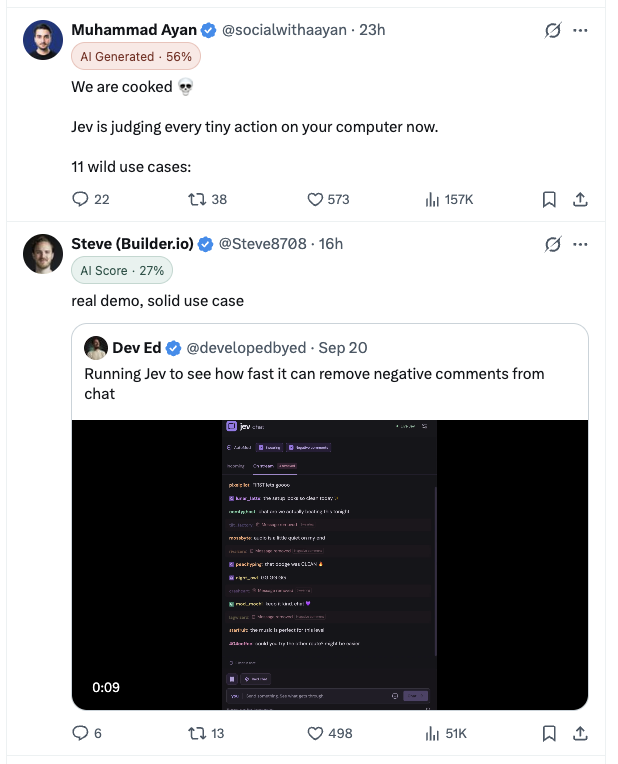
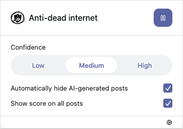
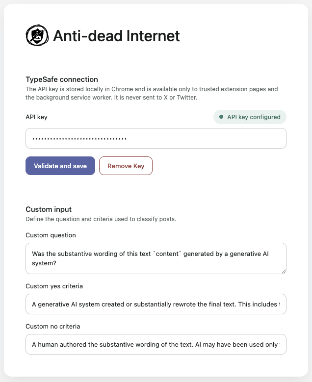

# Anti-dead internet

A Chrome Manifest V3 extension that classifies the text of posts on X/Twitter with TypeSafe. By default, it uses TypeSafe's JEV model to estimate whether a post's substantive wording was AI-generated, then displays the probability or hides posts that meet the selected threshold.

A TypeSafe API key is required to use this extension, it can be entered when the extension is first installed or from the Options page, the criteria for classifying posts can also be changed there.



## Screenshots

### Extension popup



### Options page



## Requirements

- Node.js 22.12 or later in the 22.x line, 24.x, or 26+ (the versions supported by the current locked test runner)
- Chrome 102 or newer
- A TypeSafe API key

## Development

Install dependencies and start WXT in development mode:

```sh
npm install
npm run dev
```

In `chrome://extensions`:

1. Enable **Developer mode**.
2. Choose **Load unpacked**.
3. Select `.output/chrome-mv3-dev`.
4. Open the extension popup and enter a TypeSafe API key.
5. Visit `x.com` or `twitter.com`.

The key is validated with TypeSafe before it is saved. There is no `.env`-based API-key configuration; keys are managed through the popup or Options page.

## Production build

Run all checks and create the unpacked production extension:

```sh
npm run check
```

The output is written to `.output/chrome-mv3`. To create a distributable archive, run:

```sh
npm run zip
```

## How it works

When filtering is enabled, the content script scans tweet articles currently loaded in the page DOM on `x.com`, `twitter.com`, and their subdomains. For posts containing tweet text, it:

1. Extracts and normalizes the post's text while excluding quoted-post text where possible.
2. Sends the text to the background service worker.
3. Submits a TypeSafe `noul` classification request.
4. Applies the configured threshold and display behavior to the returned probability.

Quote-only posts, media-only posts, and posts without a recognized tweet-text element are skipped. Classification depends on X/Twitter's current DOM structure and may require updates if that structure changes.

Requests are deduplicated by post fingerprint and limited to three concurrent classifications per tab and six across the extension. Successful scores are cached in memory for the current page context, up to 500 posts; they are not persisted. Failed classifications are retried after a 30-second cooldown, while a busy queue is retried after 500 milliseconds.

Pausing filtering, deleting the API key, leaving the page, or changing the custom classifier cancels active requests. Changing the confidence or display controls reuses cached scores and only updates their presentation.

## Controls

The popup provides:

- **Start/Pause:** Enables classification, or cancels active work and restores marked or hidden posts.
- **Confidence:** Sets the inclusive match threshold to Low (`0.3`), Medium (`0.5`), or High (`0.8`).
- **Automatically hide:** Hides matching posts instead of displaying an `AI Generated` badge.
- **Show score on all posts:** Displays a neutral `AI Score` badge below the threshold. Matching posts still show `AI Generated` or are hidden.
- **Settings:** Opens the Options page.

## Custom classification

The Options page lets you replace the default question, its yes/no criteria, modify or delete the API key. 

## Storage and security

- The trimmed TypeSafe API key is stored in `chrome.storage.local`.
- Filtering and custom-classifier settings are stored in `chrome.storage.sync`.
- Local storage is restricted to trusted extension contexts.
- TypeSafe requests run only in the background service worker; X/Twitter content scripts never receive the API key.
- Runtime messages are checked so settings and key changes come from extension UI, while classification requests come from X/Twitter tabs.

These controls protect the key from ordinary website scripts and other extensions, but do not make it a hardware-backed secret. Anyone with access to the Chrome profile, machine, or extension debugging tools may still be able to recover it. Use it at your own risk.

## Data handling

The normalized text of every recognized tweet article currently loaded in the page DOM may be sent to `https://api.typesafe.ai` while filtering is active, including offscreen posts. Author names, account metadata, engagement counts, and media are not deliberately included.

Scores and failure state are kept only in the content script's memory and are discarded when its page context ends.

## Debug logs

The background service-worker console logs each submitted post's full text, request ID, tab ID, elapsed time, and the complete TypeSafe response or error. These logs are accessible through Chrome's extension debugging tools.
Open `chrome://extensions`, find **Anti-dead internet**, and select its service-worker link under **Inspect views** to inspect it.

## Project structure

```text
entrypoints/background.ts           Background messaging, storage, and TypeSafe requests
entrypoints/popup/                  API-key setup and filtering controls
entrypoints/options/                API-key and custom-classifier settings
entrypoints/twitter.content/        X/Twitter scanning, queueing, caching, and page UI
lib/classification.ts               Score-to-action selection
lib/settings.ts                     Settings defaults, validation, and storage keys
lib/tweet-extractor.ts              Tweet text extraction and fingerprinting
lib/typesafe.ts                     TypeSafe request construction and response validation
tests/                              Unit tests
```

## Commands

```sh
npm run dev        # Start WXT development mode
npm run typecheck  # Run TypeScript checks
npm test           # Run unit tests
npm run build      # Build the production extension
npm run check      # Typecheck, test, and build
npm run zip        # Package the production extension
```

The test suite covers settings normalization, score actions, tweet extraction, request construction, and basic message recognition. It does not currently include browser end-to-end or live TypeSafe API tests.
